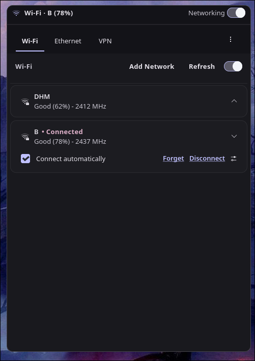
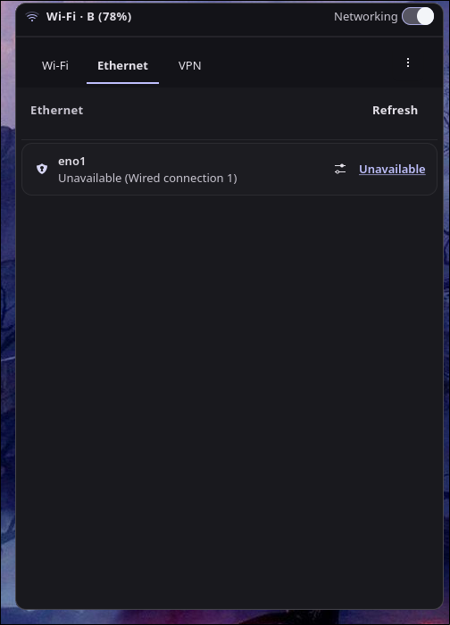
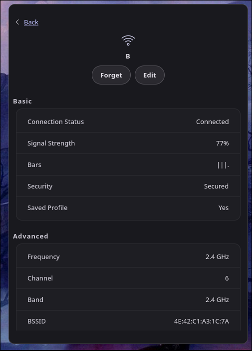
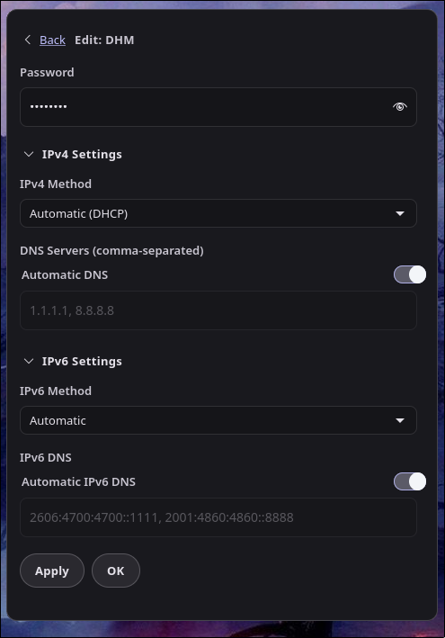

# hypr-network-manager

A themeable network manager applet for Hyprland.

## Screenshots

<table>
  <tr>
    <td align="center">
       
      Wi-Fi
    </td>
    <td align="center">
       
      Ethernet
    </td>
  </tr>
  <tr>
    <td align="center">
       
      Details
    </td>
    <td align="center">
       
      Edit
    </td>
  </tr>
</table>

## Documentation

A detailed documentation is available [here](./docs/Documentation.md), sectioned by each component of the project, including GUI, D-Bus interactions, theming, configuration, and Waybar/eww integrations.

Release and maintenance docs:

* [Changelog](./CHANGELOG.md)
* [Support Policy](./SUPPORT.md)

---

## Getting Started

The best way to get started is to check out the [Documentation](./docs/Documentation.md) for step-by-step instructions, setup guides, and examples.

---

## Features

* **Wi-Fi Support**: Management of basic and advanced wireless connection settings.
* **Wired Connections**: Monitor ethernet status and manage wired devices.
* **VPN Management**: Basic operations like list, connect, and disconnect existing VPN profiles.
* **Saved Networks**: View and manage previously connected networks.
* **Full Theming**: Fully customizable CSS-based themes.
* **Highly Configurable**: Control layout, behavior, and appearance via a simple JSON config.

### Planned Features

Upcoming features include:

* **Advanced VPN Capabilities**: Creation, editing, and detailed configuration of VPN protocols.
* **Network Hotspots**: Creation and configuration of Wi-Fi hotspots.
* **Wireless Network Sharing**: QR code based Wi-Fi credential sharing.

---

## Security

* All communication with NetworkManager is done via D-Bus
* Credentials are passed securely using NetworkManager APIs

---

## License

This project is licensed under GPL-3.0.

Some UI behavior is adapted from SwayNotificationCenter. See `THIRD_PARTY_NOTICES.md` for details.

---

## Contributing

Community contributions are welcome, whether it involves reporting bugs, suggesting features, or submitting code.

### Pull Requests

When submitting a pull request, ensure the following to facilitate an efficient review process:

* **Focused Changes**: Keep pull requests scoped to a single feature.
* **Clear Commit Messages**: Write descriptive, concise commit messages that explain *what* was changed and *why*.
* **Proper PR Descriptions**: Provide a clear explanation in the pull request description. Include details on the problem being solved, the approach taken, and testing methodologies used. 
* **Consistent Style**: Match the formatting and architectural conventions used throughout the existing Vala and GTK code.
* **Test Locally**: Verify that the application builds and runs as expected using `scripts/run-dev.sh` prior to submitting changes.

To report bugs, check the [Support Policy](SUPPORT.md) and open an issue.
